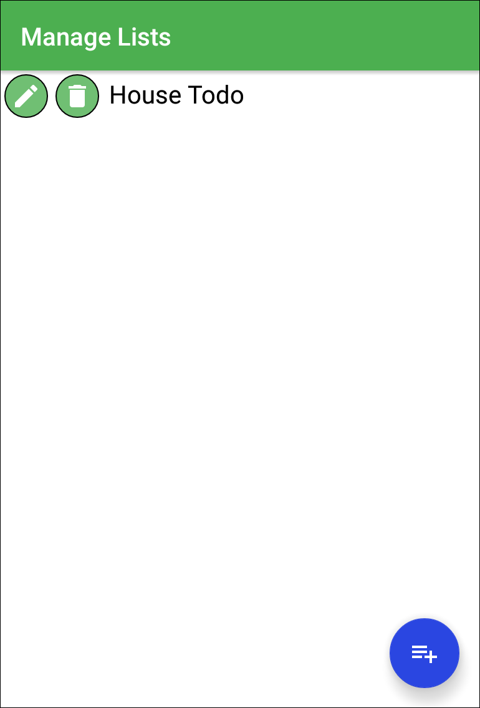
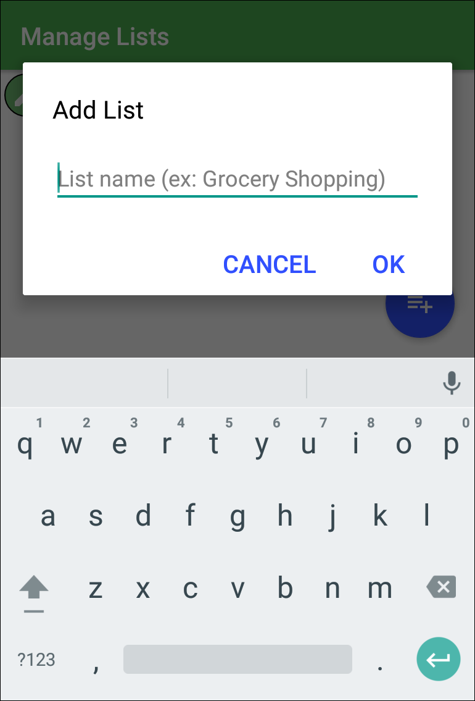
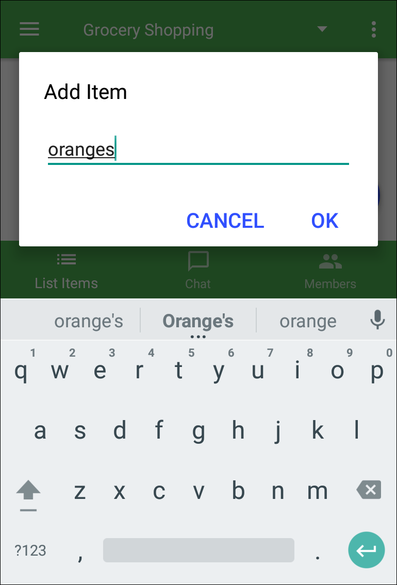
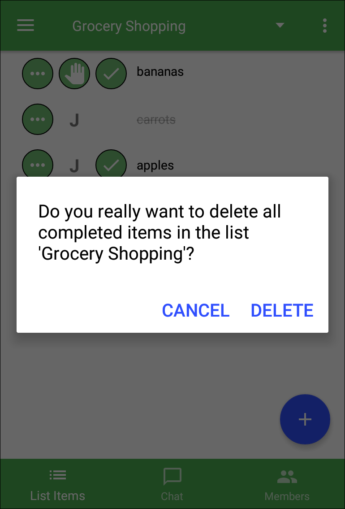
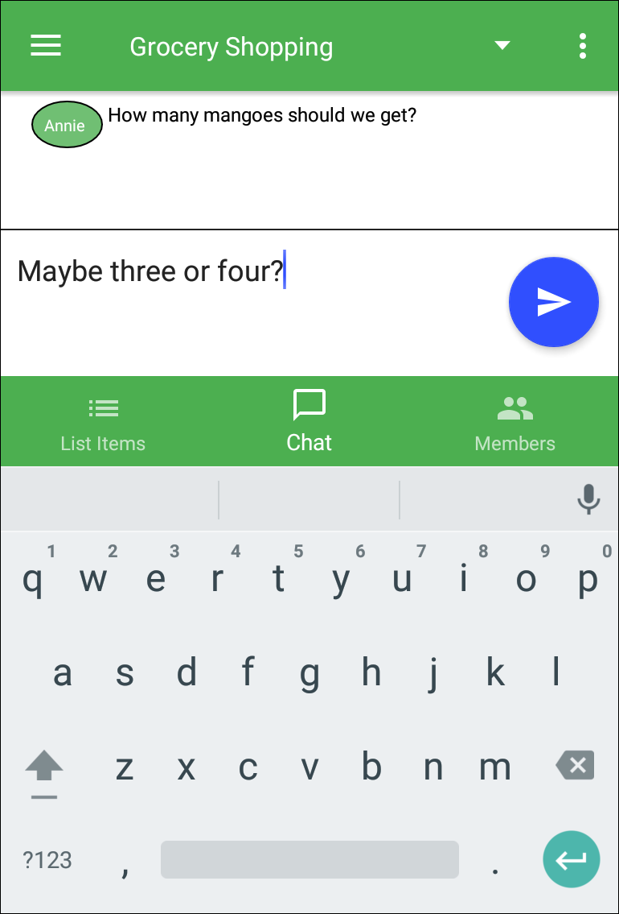

# PineTask

A sample Android project using the Firebase realtime database.  Users can create any number of lists and collaborate on them in real time.  Lists can be shared by sending an invite link.  

<table>
<tr>
<td></td>
<td></td>
<td></td>
</tr>
<tr>
<td></td>
<td></td>
<td></td>
</tr>
</table>

## Building the code

- Add your google-services.json file(s) to the /app/src/development and /app/src/production directories (contains info on connecting to your Firebase DB instance).
- Add fabric.properties to the /app directory, which should contain "apiKey=xxxx" where "xxxx" is your Crashlytics API key.
